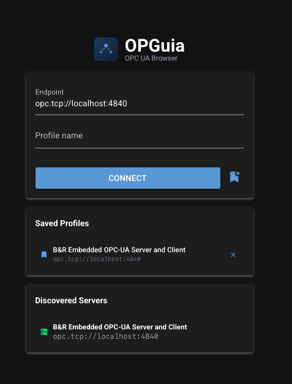
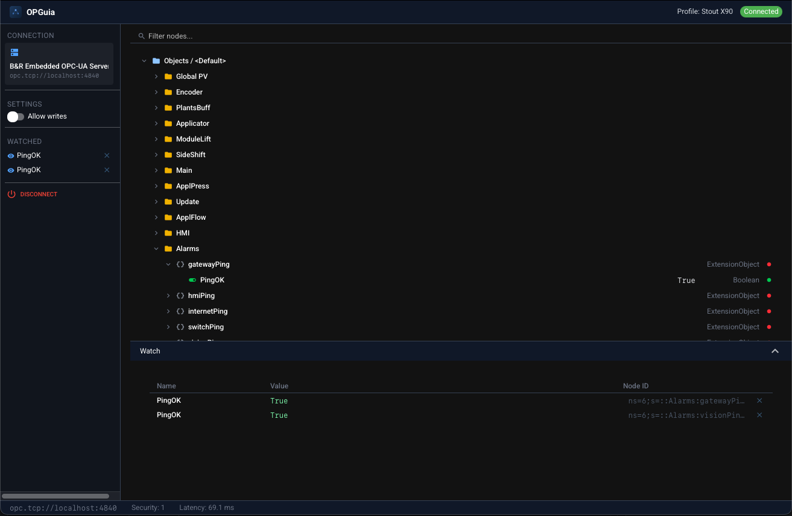

# OPGuia

[](https://pypi.org/project/opguia/)
[](https://pypi.org/project/opguia/)
[](LICENSE)
[](https://pypi.org/project/opguia/)

Dead simple OPC UA browser built with Python.

<p>
  
  
</p>
## Install

```bash
pip install opguia
```

## Usage

```bash
opguia
```

Opens a native desktop window. Enter an OPC UA endpoint or let it scan for local servers.

## Features

- Auto-scan for OPC UA servers on standard ports
- Tree-table view with inline values, types, and status
- Compact 26px rows — scan hundreds of variables at a glance
- Filter nodes by name
- Click to write writable variables (with type validation)
- Full node detail dialog with all attributes
- Custom struct types resolved to their real names
- Watch panel for live variable monitoring
- Live time-series graphs per watched variable
- Configurable poll rate (0.1s–2.0s)
- Connection profiles with per-profile settings
- SSH port-forwarding tunnel support
- Headless CLI mode (`opguia --headless`)
- Material Dark theme
- Native desktop window via pywebview
- Custom app icon and name on macOS and Windows

## Development

```bash
git clone https://github.com/kyle/opguia
cd opguia
python -m venv .venv
source .venv/bin/activate
pip install -e .
opguia
```

## Releasing

Releases trigger via GitHub Actions when a commit matching `vX.Y.Z` is pushed to `main`.
